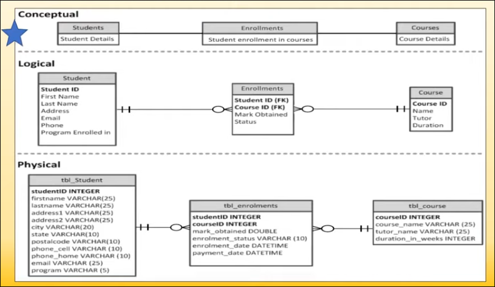

# Entity Relationship Diagram (ERD)

**Main ERD notation that is widely use** - Crows's Foot.

#### Main Components
- Entities
- Attributes
- Relationships
- Cardinality

#### Levels of abstraction
-  **Conceptual**
-  **Logical**
-  **Physical**

#### Rules and Best Practices
1.  Entities _must_ be clearly named as nouns.
1.  Entities _must not_ be duplicated in the diagram.
1.  Entities _must not_ be applications or systems.
1.  Every entity and attribute on the diagram _must_ be named.
1.  Attribute names _must_ be unique and easy to understand.
1.  Primary keys _must_ be unique to only one entity.
1.  Primary keys _must_ be listed at the top of the attribute list.
1.  Entity relationships _must_ be clear and necessary.

> **Noun technique** - to quickly identify entities from the business rules.

[Peak Youtube Video](https://youtu.be/wMgirP7z4k8)

---

# Basic Concepts of Entity-Relationship Model 

#### Types of attributes
-  **Composite Attributes** - can be devided into further parts.
> (Ex) -> `Name; middle-name, first-name, last-name. `

-  **Simple Attributes** - cannot be devided further.
> (Ex) -> `Age;`

-  **Single-Valued Attributes** - Have a single value for an entity.
> (Ex) -> `Age;`

-  **Multivalued Attributes** - Can have a set of values for a particular entity.
> (Ex) -> `LanguagesKnown; a person can know more than one language.`

-  **Derived Attributes** - Can be derived from other attributes.
> (Ex) -> `Age; since age can be derived from the date of birth.`

-  **Stored Attributes** - From which the other attributes are derived.
> (Ex) -> `BirthDate; other attributes such as age is derived from.`

> not done yet
